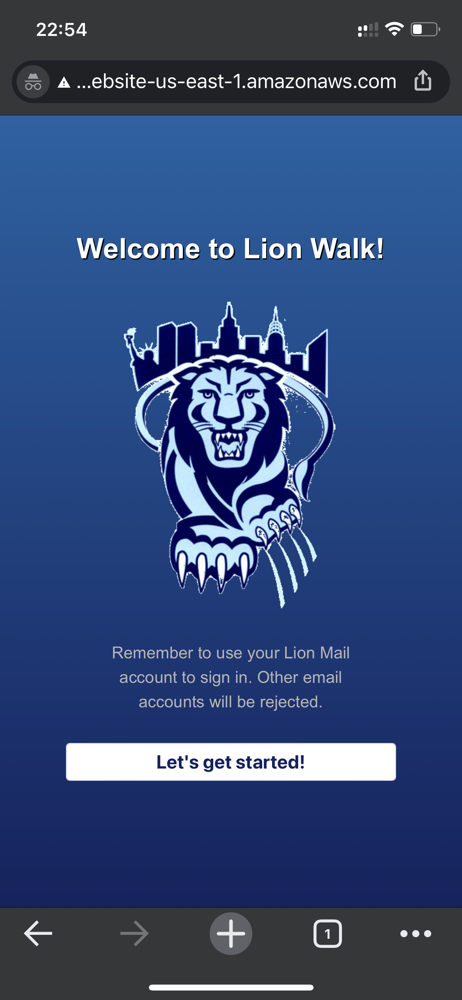
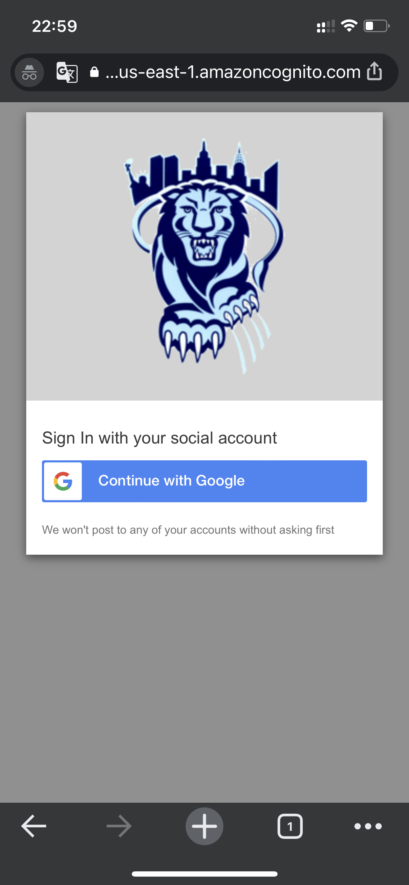
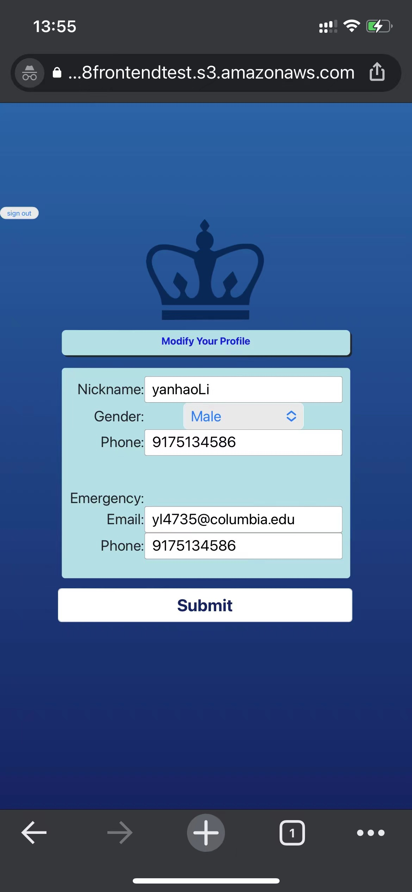
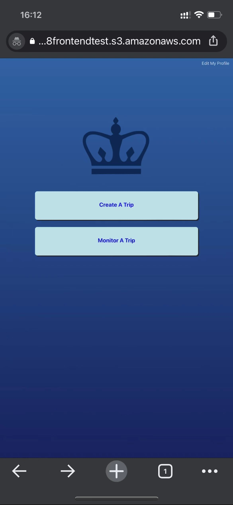
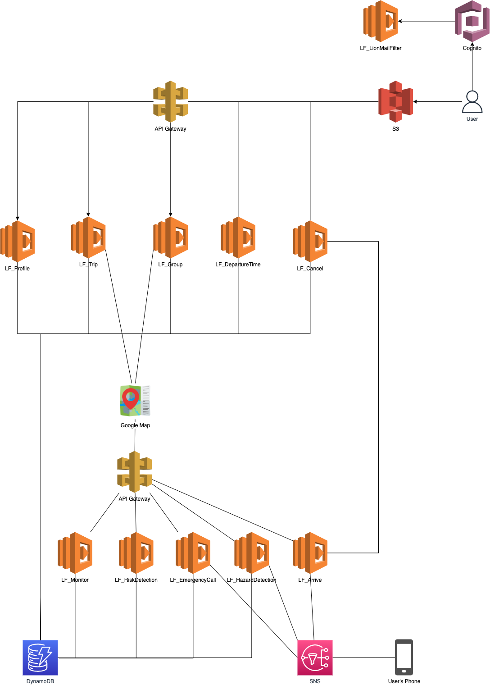

# Contributors (Alphabetic Order): 
  Chuwen Song(GitHub: songc5)
  
  Gefei Zhang (GitHub: gefeiniangniang) 
  
  Yanhao Li (GitHub: xixixixxixixixi)
  
  Yuzhao Liu (GitHub: lyz9518)

# APP
Only CU students can be authorized to register
{:height="50%" width="50%"}
Authorization
{:height="50%" width="50%"}
Fill in basic personal information
{:height="50%" width="50%"}
You have two options, start a trip or monitor a trip
{:height="50%" width="50%"}
Start your trip with your group! Any abnormal action is 
monitored and will trigger SMS notification to your 
emergency contact.
{:height="50%" width="50%"}
Trip Monitoring. If you are listed as a emergency 
contact by your friends, then you have access to all of your friends' routes and 
real time location.
{:height="50%" width="50%"}
# Architecture

# cu_walk
Columbia University Walk Partner Finder

Main Page:
http://6998frontendtest.s3-website-us-east-1.amazonaws.com

Login page: 

https://lionwalkonetwo.auth.us-east-1.amazoncognito.com/login?redirect_uri=https%3A%2F%2F6998frontendtest.s3.amazonaws.com%2FcognitoRedirect.html&response_type=token&client_id=uudop5ji4a930hd2ld8gio4qn

